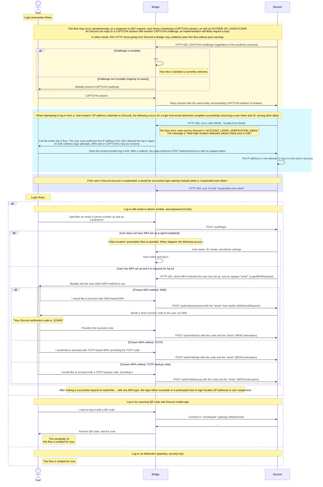

```mermaid
sequenceDiagram
    actor User
    participant Bridge
    participant Discord

    note over User: Login preemption flows:

    rect rgb(254 246 181 / 50%)
        note over User,Discord: This flow may occur spontaneously, as a response to ANY request, even those containing a CAPTCHA solution, as well as OUTSIDE OF LOGIN FLOWS. <br> As Discord can reply to a CAPTCHA solution with another CAPTCHA challenge, an implementation will likely require a loop. <br><br> In other words: ANY HTTP arrow going from Discord to Bridge may suddenly enter this flow without prior warning.
        Discord->>Bridge: HTTP 400, CAPTCHA challenge (regardless of the would-be outcome)
        alt Challenge is invisible
            Bridge->>Bridge: ???
            note right of Bridge: How this is handled is currently unknown.
        else Challenge isn't invisible  (majority of cases)
            Bridge->>User: Modally present CAPTCHA challenge
        end
        User->>Bridge: CAPTCHA solution
        Bridge->>Discord: Retry request with the same body, incorporating CAPTCHA solution in headers
    end

    rect rgb(181 244 254 / 50%)
        note over User,Discord: When attempting to log in from a "new location" (IP address unfamiliar to Discord), the following occurs for a login that would otherwise complete successfully (returning a user token and ID, among other data):
        Discord->>Bridge: HTTP 400, error code 50035, "Invalid Form Body"
        note right of Bridge: The form error code sent by Discord is "ACCOUNT_LOGIN_VERIFICATION_EMAIL". <br> The message is "New login location detected, please check your e-mail."
        Bridge->>User: Fail the entire log in flow. The user must authorize the IP address first, then attempt the log in again. <br> As with ordinary login attempts, MFA and or CAPTCHAs may be involved.
        User->>Discord: Visits the email-provided log in link. After a redirect, the page performs POST /auth/authorize-ip with an opaque token.
        Discord->>Discord: The IP address is now allowed to log in to the user's account.
    end

    rect rgb(200 210 255 / 50%)
        note over User,Discord: If the user's Discord account is suspended, a would-be successful login attempt instead yields a "suspended user token."
        Discord->>Bridge: HTTP 403, user ID and "suspended user token"
    end

    note over User: Login flows:

    alt
        note over User,Discord: Log in with email or phone number, and password (Creds)
        User->>Bridge: Specifies an email or phone number as well as <br> a password
        Bridge->>Discord: POST /auth/login

        alt User does not have MFA set up (LoginCompleted)
            note over Bridge: ("New location" preemption flow is possible. When skipped, the following occurs:)
            Discord->>Bridge: User token, ID, locale, and theme settings
            Bridge->>Bridge: Save token and log in
        else User has MFA set up and it is required for log in
            Discord->>Bridge: HTTP 200, which MFA methods the user has set up, and an opaque "ticket" (LoginMFARequired)
            Bridge->>+User: Modally ask the user which MFA method to use
            activate User
            activate User

            alt Chosen MFA method: SMS
                User->>-Bridge: I would like to proceed with SMS-based MFA
                Bridge->>Discord: POST /auth/mfa/sms/send with the "ticket" from earlier (SMSSendRequest)
                Discord->>User: Sends a short numeric code to the user via SMS
                note over User: "Your Discord verification code is: 123456"
                User->>Bridge: Provides the received code
                Bridge->>Discord: POST /auth/mfa/sms with the code and the "ticket" (MFAContinuation)
            else Chosen MFA method: TOTP
                User->>-Bridge: I would like to proceed with TOTP-based MFA, providing the TOTP code
                Bridge->>Discord: POST /auth/mfa/totp with the code and the "ticket" (MFAContinuation)
            else Chosen MFA method: TOTP backup code
                User->>-Bridge: I would like to proceed with a TOTP backup code, providing it
                Bridge->>Discord: PSOT /auth/mfa/backup with the code and the "ticket" (MFAContinuation)
            end
        end
        note over Bridge: After making a successful request to /auth/mfa/… with any MFA type, the login either succeeds or is preempted due to login location (IP address) or user suspension.
    else
        note over User,Discord: Log in by scanning QR code with Discord mobile app
        User->>Bridge: I want to log in with a QR code
        Bridge->>Discord: Connect to "remoteauth" gateway (WebSocket)
        Discord->>Bridge: …
        Bridge->>User: Present QR code, wait for scan
        note right of User: The remainder of <br> this flow is omitted for now.
    else
        note over User,Discord: Log in via WebAuthn (passkey, security key)

        note right of User: This flow is omitted for now.
    end
```
